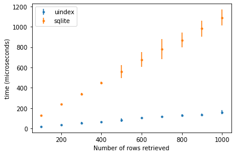

# Uindex - Universal index

[Uindex][0] is a data store, for data that can be parsed as sentences in some context-free language.
With it, it is possible to create databases (db), add data to them, and query that data.
The shape of each db (or, we might say, its schema) is given by a [parsing expression grammar][1] (PEG),
and each database holds data in the form of unicode strings
structured according to the top production of the provided PEG.

Queries to uindex also take the forms specified in the PEG:
they are just sentences in the language described by the PEG.
In addition, in queries we can use variables, in place of any of the productions in the PEG,
to retrieve unknown values from the database.
We can also use more than a single sentence in the queries.

Uindex stores data in such a manner that
adding new sentences to a db is O(1) with respect to the size of the db,
and that allows "fully indexed" queries to be resolved in O(1) also wrt the size of the db.
See below for the meaning of "fully indexed" in this context.

## Example

As an example, we will build a very simple database of triples, subject-verb-object.
Words (be they subjects, verbs or objects) will have the form of strings of alphanumeric characters,
and sentences will consist in 3 such words separated by spaces and terminated by a dot.
XXX uindex fact terminator XXX
So an example sentence in this db could be ``susan likes oranges``.
The PEG for this would be:

```pest
fact        = { word ~ word ~ word }

word        = @{ ASCII_ALPHANUMERIC+ }

WHITESPACE  = { " " | "\t" | "\r" | "\n" }
```
&nbsp;
&nbsp;

Uindex uses [Pest][2] to deal with PEGs, so look up the pest documentation for
the [specific syntax][4] for PEGs used by uindex. In particular, the
``WHITESPACE`` rule is special for Pest, and if provided, it will be inserted
between any 2 other chained or repeated productions (except within atomic productions,
which are marked with `@`.)

The only uindex specific thing in the grammar above is naming the top production ``fact``;
uindex requires it.

Now we want to specify which of our productions can be unknowns in our queries.
We transform our grammar as follows:

```pest
var         = @{ "X" ~ ('0'..'9')+ }

fact        = { word ~ word ~ word }

v_word      = @{ ASCII_ALPHANUMERIC+ }

word        = _{ var | v_word }

WHITESPACE  = { " " | "\t" | "\r" | "\n" }
```
&nbsp;
&nbsp;

In short, we provide a production for variables, we prefix the production we want variables to be able to match
with ``v_``, and then we provide a new production, with the old name (without the ``v_`` prefix),
which is the sum of the old production and `var`.
We can mark as many productions like this as we want, and they can be terminal or not.

To use this grammar, we need to set up some boilerplate. At this moment, uindex can only be used from [Rust][3].

So we store the code above in a file named ``grammar.pest``, which we place at the root of our rust package.

We must add some dependencies to our `Cargo.toml`:

```toml
[dependencies]
uindex = "0.1.1"
uindex_derive = "0.1.1"
pest = "2.1.3"
pest_derive = "2.1.0"
log = "0.4"
env_logger = "0.7.1"
```
&nbsp;
&nbsp;

Then, we build our knowledge base based on the grammar, adding this code in a rust module:

```rust
use crate::uindex::kbase::DBGen;
use crate::uindex::kbase::DataBase;

extern crate uindex
#[macro_use]
extern crate uindex_derive;

extern crate pest;
#[macro_use]
extern crate pest_derive;

#[derive(DBGen)]
#[grammar = "grammar.pest"]
pub struct DBGenerator;
```
&nbsp;
&nbsp;

This provides us with a ``struct`` ``DBGenerator``, whose only responsibility is to
create databases that can hold sentences according to ``grammar.pest``.
So now we can build a database:

```rust
let db = DBGenerator::gen_db();
```
&nbsp;
&nbsp;

We can add data to it:

```rust
db.tell("susan likes oranges.");
db.tell("susan likes apples.");
db.tell("john likes oranges.");
db.tell("john hates apples.");
```
&nbsp;
&nbsp;

Finally we can query the system like:

```rust
db.ask("john likes oranges.");  // -> true
db.ask("john likes apples.");  // -> false
db.ask("susan likes X1.");  // -> [{X1: oranges}, {X1: apples}]
db.ask("X1 likes oranges. X1 likes apples.");  // -> [{X1: susan}]
db.ask("susan likes X1. john likes X1.");  // -> [{X1: oranges}]
db.ask("susan X1 apples. john X1 apples.");  // -> []
```

And that's it.

## API

### Grammar

### DB Generator

### tell

### ask

## Complexity

### Data structures and algorithms

### Benchmarks

Here we compare the performance of uindex with the performance of in memory sqlite (driven from python).
The aim is not to propose uindex as a replacement of sqlite, but simply to show that uindex performs
acceptably, i.e. that its costs, in terms of both time and space, are sensible and grow sensibly.

Also note that in terms of space, there is work to be done; I must admit I dont understand about a 3rd
of the space taken by a uindex db.

#### Simple db, simple query

For this benchmark we used data with a very simple structure, just a set of triples like in the above example,
and fully qualified queries that would just retrieve a single row / sentence, to obtain a yes/no answer.
For sqlite, we used a single table with 3 varchar columns, with a single index using all 3 columns.
We added up to 10.000.000 entries, and measured the time taken to add new entries and to resolve single answer queries.
In this benchmark, the performance in both cases did not degrade with the size of the db.

|| uindex | sqlite |
|-------------|------------|-------------|
| insert  | 4.36 +/- 0.45 | 12.52 +/- 1.26 |
| query | 4.00 +/- 0.53 | 7.94 +/- 0.91 |

[Code for the uindex benchmark](https://github.com/enriquepablo/uindex/tree/mirrors/examples/isa/src)
[Code for the sqlite benchmark](https://github.com/enriquepablo/uindex/tree/mirrors/python/isa.py)

#### Simple db, query with intersection

For this benchmark we used the same data as in the previous benchmark,
and queries that would extract a value common to 2 rows / sentences.
In this benchmark, the performance in both cases also did not degrade with the size of the db.

|| uindex | sqlite |
|-------------|------------|-------------|
| query | 9.69 +/- 0.73 | 21.79 +/- 2.55 |

[Code for the uindex benchmark](https://github.com/enriquepablo/uindex/tree/mirrors/examples/double-q/src)
[Code for the sqlite benchmark](https://github.com/enriquepablo/uindex/tree/mirrors/python/double-q.py)

#### Simple db, query returning multiple rows

For this benchmark we used the same data as in the previous benchmarks,
and queries that would extract a number of rows, from 100 to 1000.
Adding data had the same cost as in the previous benchmark.
The cost of querying data grew a bit more with the number of hits for sqlite:



[Code for the uindex benchmark](https://github.com/enriquepablo/uindex/tree/mirrors/examples/isa-many/src)
[Code for the sqlite benchmark](https://github.com/enriquepablo/uindex/tree/mirrors/python/isa-many.py)

#### Db with 3 tables, query joining all 3

Here we set up a db with 3 tables, one of them with foreign keys to the other 2,
and query for data in one of the boundary tables providing data from the other.
There was no degradation of performance adding up to 1.000.000 entries in each table,
neither for uindex nor for sqlite.

|| uindex | sqlite |
|-------------|------------|-------------|
| insert  | 10.25 +/- 0.86 | 47.56 +/- 8.01 |
| query | 16.94 +/- 1.06 | 12.82 +/- 0.75 |

Note that for sqlite, in this case we wanted to check for duplicates before inserting,
affecting the performance. For uindex this is given.

[Code for the uindex benchmark](https://github.com/enriquepablo/uindex/tree/mirrors/examples/three-tables/src)
[Code for the sqlite benchmark](https://github.com/enriquepablo/uindex/tree/mirrors/python/three-tables.py)

#### Recursive db.

In this benchmark we set up a store of trees of varying width (number of children per branch)
and depth (number of branches from the root to a leaf). An example data point in this scheme:

(6 (60 617 64) (31 493 538))

Each parenthesis is a branch, in which the 1st entry is the name of the branch and the rest are the children;
so the previous is a depth 2 width 2 tree.

With sqlite, I have tried with
3 tables, Branch Leaf and Child, where Child would hold a "parent" foreign key to Branch
and a "child" forign key to either Child or Branch. I haven not found a combination of
indexes that gave a performance anywhere near acceptable,
so I am not including sqlite results here. It could take 10 and 12 seconds to find a tree
in a db with 20.000 trees of depth 2 and width 2; obviously sqlite is not meant for this kind of load.

However, I want to show that uindex has no problem with this kind of structure,
So here is the performance of uindex with trees of depth 2 and width 2, depth 2 and width 3,
and depth 3 and witdth 3, querying just for the presence of a particular tree (no unknowns in the query):

|| insert | query |
|-------------|------------|-------------|
| 2-2 | 10.73 +/- 2.19 | 7.75 +/- 1.30 |
| 2-3 | 17.40 +/- 3.14 | 12.26 +/- 1.47 |
| 3-3 | 55.73 +/- 5.47 | 38.79 +/- 3.26 |

[Code for the uindex benchmark](https://github.com/enriquepablo/uindex/tree/mirrors/examples/recursive/src)
[Code for the sqlite benchmark](https://github.com/enriquepablo/uindex/tree/mirrors/python/recursive.py)

## TODO

Note that this is a work in progress. At the moment uindex does not even have persistence;
it only exists in memory. There is also room for improvement in the sizes of the dbs,
and queries would benefit by using some parallellism. There is also work being done to
add (numeric and string) constraints to the query variables.

&copy; EnriquePérez Arnaud &lt;enrique at cazalla dot net&gt; 2021

[0]:https://uindex.modus_ponens.net
[1]:https://en.wikipedia.org/wiki/Parsing_expression_grammar
[2]:https://pest.rs
[3]:https://www.rust-lang.org
[4]:https://pest.rs/book/grammars/syntax.html
